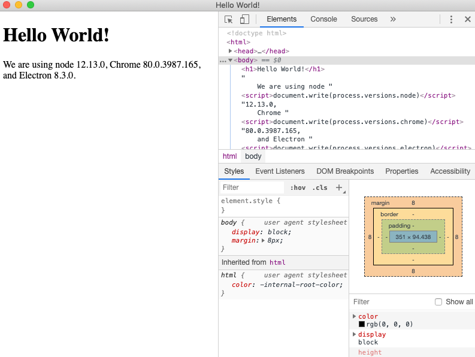
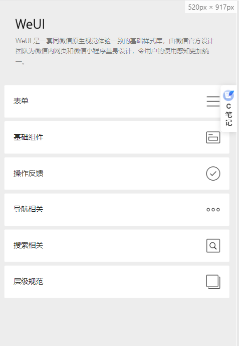
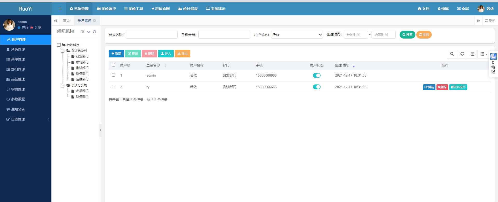

# 框架

## 自动化

### Auto.js pro

解放双手，用JavaScript创造您自己的应用与自动化工具

官网：[Auto.js Pro (autojs.org)](https://pro.autojs.org/)

github：[hyb1996/Auto.js: A UiAutomator on android, does not need root access(安卓平台上的JavaScript自动化工具) (github.com)](https://github.com/hyb1996/Auto.js)

## 快速生成前端

### docusaurus

一个快速生成文档的框架，可以把md格式的文件转化为网页，简单易用

官网：[Build optimized websites quickly, focus on your content | Docusaurus](https://docusaurus.io/)

github：https://github.com/facebook/docusaurus

## 开发工具

### electron

使用 JavaScript，HTML 和 CSS 构建跨平台的桌面应用程序

官网：[Electron | 使用 JavaScript，HTML 和 CSS 构建跨平台的桌面应用程序。 (electronjs.org)](https://www.electronjs.org/)

github：**[Electron (github.com)](https://github.com/electron)**

### weui

WeUI 是一套同微信原生视觉体验一致的基础样式库，由微信官方设计团队为微信内网页和微信小程序量身设计，令用户的使用感知更加统一。

github：[Tencent/weui: A UI library by WeChat official design team, includes the most useful widgets/modules in mobile web applications. (github.com)](https://github.com/Tencent/weui)

### 若依

基于SpringBoot的权限管理系统，快速生成spring boot项目

官网：**[RuoYi 若依官方网站 |后台管理系统|权限管理系统|快速开发框架|企业管理系统|开源框架|微服务框架|前后端分离框架|开源后台系统|RuoYi|RuoYi-Vue|RuoYi-Cloud|RuoYi框架|RuoYi开源|RuoYi视频|若依视频|RuoYi开发文档|若依开发文档|Java开源框架|Java|SpringBoot|SrpingBoot2.0|SrpingCloud|Alibaba|MyBatis|Shiro|OAuth2.0|Thymeleaf|BootStrap|Vue|Element-UI||www.ruoyi.vip](http://ruoyi.vip/)**

github：[yangzongzhuan/RuoYi: (RuoYi)官方仓库 基于SpringBoot的权限管理系统 易读易懂、界面简洁美观。 核心技术采用Spring、MyBatis、Shiro没有任何其它重度依赖。直接运行即可用 (github.com)](https://github.com/yangzongzhuan/RuoYi)
