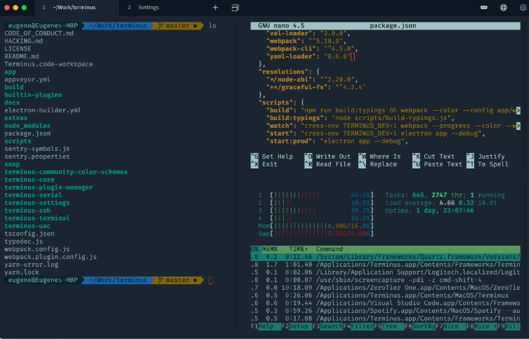
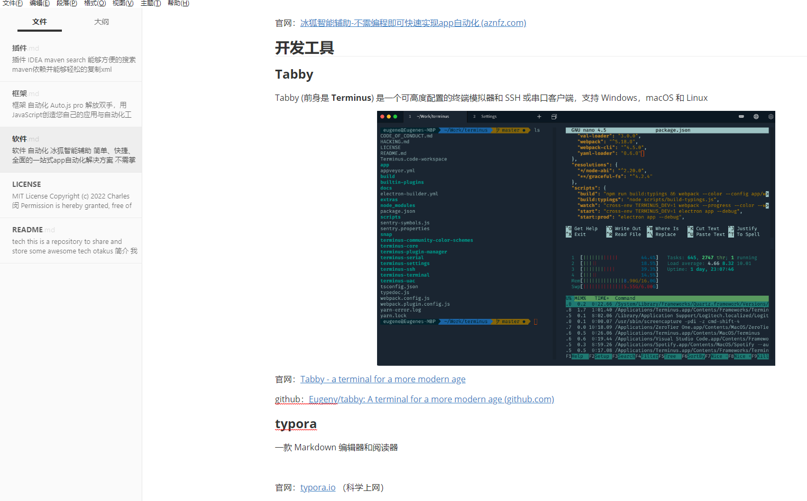
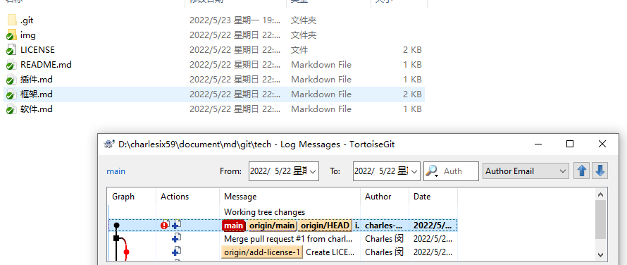

# 软件

## 自动化

### 冰狐智能辅助

简单、快捷、全面的一站式app自动化解决方案

不需掌握程序开发，即可快速实现各种app自动化功能

官网：[冰狐智能辅助-不需编程即可快速实现app自动化 (aznfz.com)](https://aznfz.com/)

## 开发工具

### Tabby

Tabby (前身是 **Terminus**) 是一个可高度配置的终端模拟器和 SSH 或串口客户端，支持 Windows，macOS 和 Linux

官网：[Tabby - a terminal for a more modern age](https://tabby.sh/)

github：[Eugeny/tabby: A terminal for a more modern age (github.com)](https://github.com/Eugeny/tabby)

### typora

一款 Markdown 编辑器和阅读器

 <i>是的，我就是在用这个东西编辑md文件 </i>

官网：[typora.io](https://typora.io/) （科学上网）

中文站：[Typora 官方中文站 (typoraio.cn)](https://typoraio.cn/)

github：[github.com](https://github.com/typora)

## tortoiseGit

一个非常简单易用的git- gui，并且提供了强大的右键拓展和丰富的图标标识

官网：[TortoiseGit – Windows Shell Interface to Git](https://tortoisegit.org/)

github：[TortoiseGit/TortoiseGit: Windows Explorer Extension to Operate Git; Mirror of official repository https://tortoisegit.org/sourcecode (github.com)](https://github.com/TortoiseGit/TortoiseGit)
